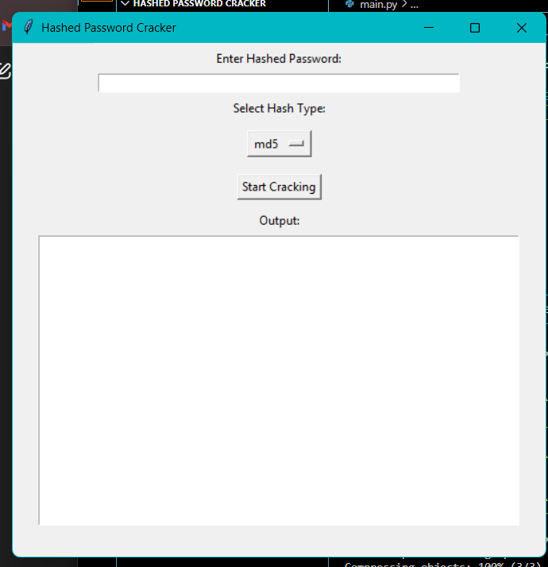
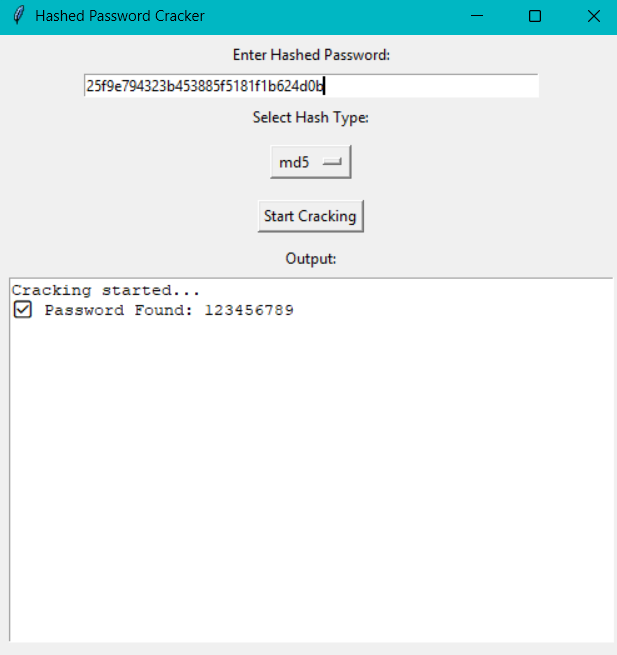

# Hashed Password Cracker

## Project Description
This project is a password cracker that works with different hashing algorithms. It allows you to crack passwords by using a wordlist and selected hash algorithm.

## Installation

1. Clone the repository:
   ```bash
   git clone https://github.com/amitt-51/hashed-password-cracker.git
2. Navigate into the project directory:
   ```bash
   cd hashed-password-cracker
3. Install the required dependencies:
   ```bash
   pip install -r requirements.txt
   
## Usage 
      python main.py

## 🖥️ GUI Interface


## 🔐 Enter Hashed Password Interface

This interface is used to enter the hashed password. It provides a simple and secure way for users to input their password.


## 🧮 Select Hash Type Interface

This interface allows the user to select the type of hashing algorithm (e.g., MD5, SHA-256) before processing the password.


## ⚡ Cracking Button Interface

This button initiates the password cracking process. Once clicked, it triggers the algorithm to attempt to find the correct password by comparing hashed values.


## 📊 Output Interface

This image shows the output generated after the password cracking process is completed. It displays the results of the hashed password comparison, indicating whether the correct password was found or not.


## 👨‍💻 About the Author

This project is created and maintained by **Amit Kumar Singh**. Feel free to reach out for suggestions, feedback, or collaboration.

- **GitHub**: [amitt-51](https://github.com/amitt-51)
- **Email**: hello@singhamit.in


